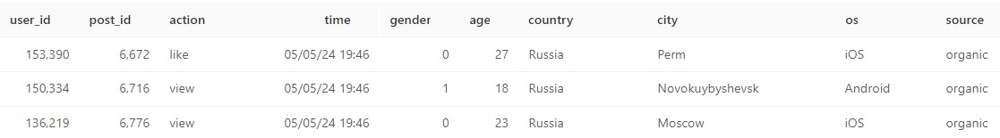
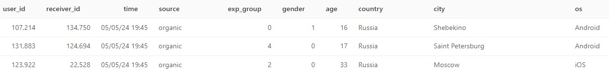
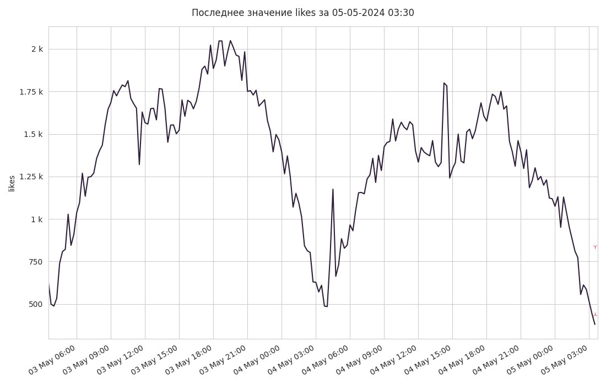

<h1>Система алертов приложения: лента новостей и мессенджер</h1>

Система каждые 15 минут проверяет ключевые метрики – активные пользователи в ленте / мессенджере, просмотры, лайки, CTR, количество отправленных сообщений.

Для выгрузки метрик выполняется запрос в ClickHouse, используется библиотека pandahouse.

В случае отклонения метрики отправляется информация в телеграм чат.

<h2>Структура данных в ClickHouse</h2>
<h3>Таблица feed_actions</h3>

<h3>Таблица message_actions</h3>

<h2>Принцип проверки:</h2>
<ul>
  <li>Отбираются 5 значений метрики за последние 7 дней:</li>
  <ul>
    <li>Для каждого дня две 15-ти минутки до текущего времени + текущее время + две 15-ти минутки после текущего времени.</li>
    <li>В текущий день будут отобраны значения до текущего времени (3 значения).</li>
  </ul>
  <li>Внутри каждого дня отбираются значения в интервале ±2σ, чтобы исключить влияние прошлых выбросов.</li>
  <li>Для отобранных значений считается доверительный интервал ±3σ.</li>
  <li>Если последнее значение выходит за пределы этого интервала – отправляется alert в телеграм.</li>
</ul>
<h2>Пример алерта в телеграм</h2>

Сообщение:

<blockquote>
  

  05-05-2024 03:30
   
  Метрика likes
   
  Текущее значение: 380.0
   
  Границы доверительного интервала: (436.93 - 837.57)
   
  Ссылка на дашборд:
   
  http://site
  

</blockquote>

График изменения метрики за последние 48 часов:

